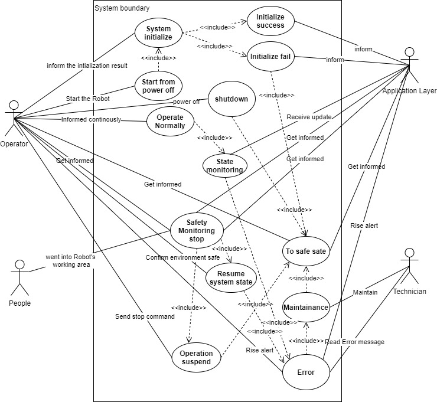
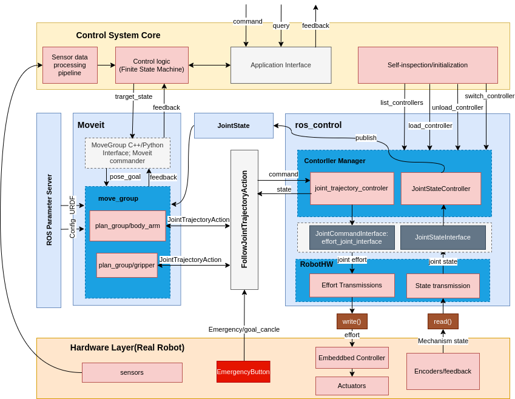
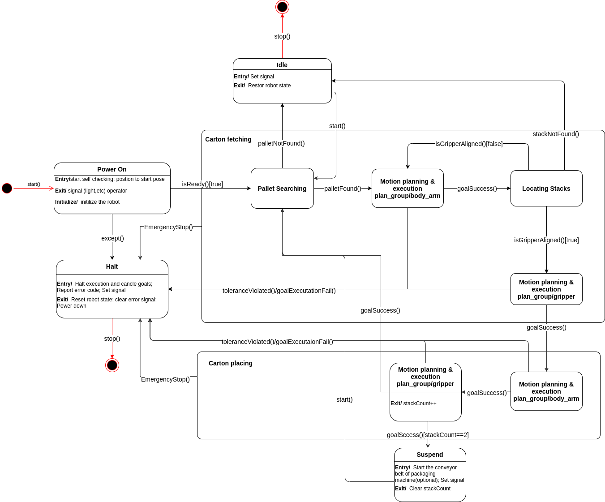
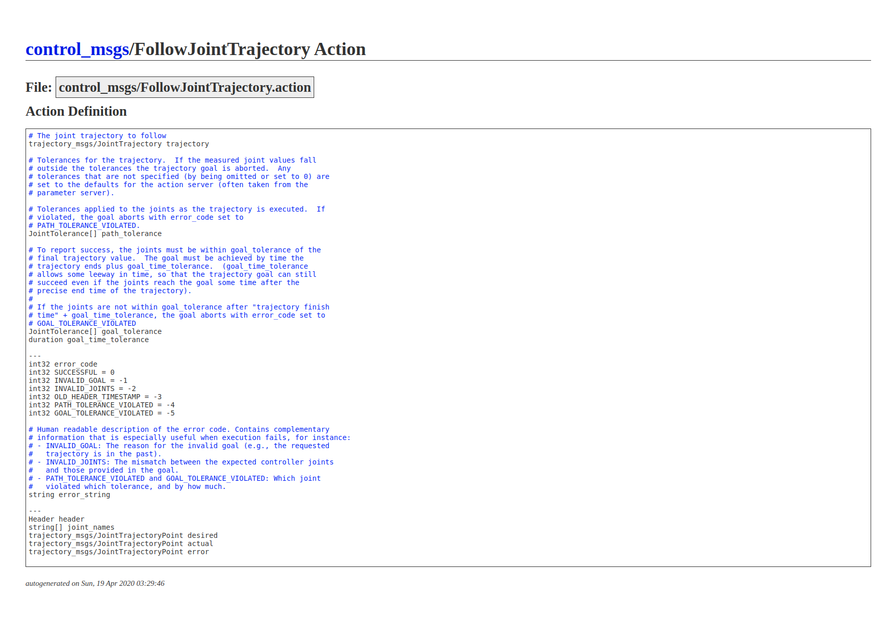

# BoxBot Control System Arc Research

## Search Plan

1. **Keyword:** "Robot", "Control System", "Architecture"

   [Chen, N., & Parker, G. (1994). Design of a robot control system architecture. *Microprocessors and Microsystems*, *18*(6), 323–330. https://doi.org/10.1016/0141-9331(94)90047-7](../../references/design_of_a_robotic_control_system_architecture.pdf)

   |_ **Keyword**++: "Sensor Based Robotics", "PID algorithm", "motion planning", "trajectory control", "synchronize", "priority", "async safety"

   |_ **Key ideas**: 

   * Separation of operating and monitoring cores; 
   * [motion planner]-->[trajectory control]-->[servo control]; 
   * inter-components communication: Pipe, event(semaphore), signal

   

2. **Keyword**: "ROS", "synchronize", "priority"

   [Saito, Y., Azumi, T., Kato, S., & Nishio, N. (2016). Priority and Synchronization Support for ROS. *2016 IEEE 4th International Conference on Cyber-Physical Systems, Networks, and Applications (CPSNA)*, 77–82. https://doi.org/10.1109/CPSNA.2016.24](../../references/priority_and_synchronization_support_for_ROS.pdf)

   |_ **Key idea**: 

   * a priority based message transmission mechanism

   |_ **Question**: Is BoxBot a sequential single task system or a multi-task real-time system?

3. **Keyword:** "Sensor based", "Robot", "Control system"

   [Bier, H. (Ed.). (2018). *Robotic Building*. Springer International Publishing. https://doi.org/10.1007/978-3-319-70866-9](../../references/Bier - 2018 - Robotic Building.pdf) Chapter 2

   |_ **Keyword++**:  SIL/PL; **European robot standard (EN 775:1992)**; **ISO 10218-1:2006**( Collaboration modes and safety requirements between human and robot); Pilz SafetyEye; **SFS-EN ISO 13849-1 2015**; **ISO/TS 15066**; Safety-rated monitored stop; CCD Cameras; 2D laserprofilers

   |_ **Key idea**: 

   * Failure does not cause danger
   * The safety standard(EN 775:1992) says: in an automated run, the moving robot stops (protective stop removes servo power) before a human can touch it
   * ISO 10218-1:2006: 
     * Monitored stopping: the robot stops when a person enters and restarts when the person leaves the robot area 
     * Hand guiding: The robot is guided by hand by pushing or with a handle
     *  Speed and position monitoring: robot impact is prevented by controlling speed and separation distance
     * Power and force limiting: harmful impacts are prevented by controlling the robot force and power.

4. **Keyword**: "Sensor based", "Robot", "Software"

   [ de Gea Fernández, J., Mronga, D., Günther, M., Knobloch, T., Wirkus, M., Schröer, M., Trampler, M., Stiene, S., Kirchner, E., Bargsten, V., Bänziger, T., Teiwes, J., Krüger, T., & Kirchner, F. (2017). Multimodal sensor-based whole-body control for human–robot collaboration in industrial settings. *Robotics and Autonomous Systems*, *94*, 102–119. https://doi.org/10.1016/j.robot.2017.04.007 ](../../references/de Gea Fernández et al. - 2017 - Multimodal sensor-based whole-body control for hum.pdf)

   |_ **Keyword**++: joint waypoint; object-relative Cartesian waypoints; event-reactor pattern;

   |_ **Key idea**: 

   * the behavior of the component should solely depend on the input and configuration instead of its history

   * action synchronization design: 

     * sequence: later task uses the success signal from the previous one as start command
     * Sync-group: wait until all tasks in the group are done

     

5. **Keyword**: "Sensor based", "ROS", "Architecture"

   [*IEEE Xplore Full-Text PDF:* (n.d.). Retrieved October 12, 2020, from https://ieeexplore-ieee-org.tudelft.idm.oclc.org/stamp/stamp.jsp?tp=&arnumber=8090199](../references/Design of Atonomous Mobile Robot Based on ROS.pdf)

   |_ **Key idea**: 

   *  SBC + MCU
     * SBC: run control system
     * MCU: handle sensor data reading and robot navigation, receive command from the SBC

## User Case Analysis

### Use case diagram

### Description

> **NUMBER**: U1
>
> **USE CASE:**  Start from power off
>
> **ACTOR:** Operator
>
> **BASIC FLOW:** The operator start the robot either by hitting a button or remotely. The robot initiates itself and inform the operator and the application layer when the initialization is done. The robot starts to work after that. 
>
> **RELATIVE REQUIREMENTS**:

> **NUMBER**: U2
>
> **USE CASE**: System initialize
>
> **ACTOR**: Operator, Application layer
>
> **BASIC FLOW**: The robot do self check after power on. If everything subsystem works fine, then the system goes to initial state and inform the operator and application layer; Otherwise, it brings the system to the safe state and inform the operator and application layer.
>
> **RELATIVE REQUIREMENTS**:

> **NUMBER**: U3
>
> **USE CASE**: initialize success
>
> **ACTOR**: Operator, Application layer
>
> **BASIC FLOW**: When the robot successfully transfers from initial state to the working state, it informs the application layer and operator.
>
> **RELATIVE REQUIREMENTS**:

> **NUMBER**: U4
>
> **USE CASE**: initialize fail
>
> **ACTOR**: Operator, Application layer
>
> **BASIC FLOW**: If error happens during the initialization, the robot should first enter the safe state then inform the operator and the application layer. 
>
> **RELATIVE REQUIREMENTS**:

> **NUMBER**: U5
>
> **USE CASE:** Shutdown
>
> **ACTOR**: Operator, Application layer
>
> **BASIC FLOW**: When operator shutdown the robot by hitting a button or remotely, it should first bring the system to the safe state then power off. 
>
> **RELATIVE REQUIREMENTS**:

> **NUMBER**: U6
>
> **USE CASE**: Operate Normally
>
> **ACTOR**: Operator, Application layer
>
> **BASIC FLOW**: The robot fetch carton boards from the pallet and put them on the conveyor belt normally. It should indicates its working state continuously to the operator and the application layer.
>
> **RELATIVE REQUIREMENTS**:

> **NUMBER**: U7
>
> **USE CASE**: State monitoring
>
> **ACTOR**: Operator, Application layer
>
> **BASIC FLOW**: The robot keep monitor its working state and update the operator and the application layer about it. If error occurs, it will inform the operator and the application layer that a maintained is required. 
>
> **RELATIVE REQUIREMENTS**:

> **NUMBER**: U8
>
> **USE CASE**: Safety monitoring stop
>
> **ACTOR**: People, Operator, Application layer
>
> **BASIC FLOW**: The robot keep monitor its environment, and when a person enters into the working area it will stop the operation and brings the system into the safe state, then inform the operator and the application. If the when the environment restores to normal, the robot will resume its working state before suspension.
>
> **RELATIVE REQUIREMENTS**:

> **NUMBER**: U9
>
> **USE CASE**: Operation suspend
>
> **ACTOR**: Operator, Application layer
>
> **BASIC FLOW**: When the operator suspend the operation by hitting a button or remotely, the robot should stop the current action, save the working state, then go into safe state. 
>
> **RELATIVE REQUIREMENTS**:

> **NUMBER**: U10
>
> **USE CASE**: Resume system state
>
> **ACTOR**: Operator, Application layer
>
> **BASIC FLOW**: When the operator confirms the event that caused the robot to be suspended has disappeared. The robot can resume its previous working state by him/her hitting a button or remotely allow it. The robot inform the operator and the application layer when the resume success. Otherwise, the robot reports the error and bring the system to safe state. 
>
> **RELATIVE REQUIREMENTS**:

> **NUMBER**: U11
>
> **USE CASE**: Error
>
> **ACTOR**: Operator, Application layer
>
> **BASIC FLOW**: When the robot encounters an error, it will rise an alerts to both the operator and the application layer. Then it brings the system to maintenance state. The technician can read error message out of the robot. 
>
> **RELATIVE REQUIREMENTS**:

> **NUMBER**: U12
>
> **USE CASE**: Maintenance 
>
> **ACTOR**: Technician
>
> **BASIC FLOW**: When the robot is about to get maintained, it will bring the system into the safe state where the technician can work safely. During maintenance the technician can easily access the control system, and conduct debugging,  update or system reset. 
>
> **RELATIVE REQUIREMENTS**:

> **NUMBER**: U13
>
> **USE CASE**: To safe state
>
> **ACTOR**: Operator, Application layer	
>
> **BASIC FLOW**: The robot first drains any energy in the system completely that it can case harm to outside no more, and lock the system to prevent it transfer to another state. Then it informs the operator and the application layer that it's in safe state. 
>
> **RELATIVE REQUIREMENTS**:

## Software Requirement Analysis

### F. Functional Requirements

#### A. Must Haves

1. The control system must be able to start. (U1)
2. The control system must be able to be shutdown. (U5)
3. The control system must be able to read data from the sensors. (U6)
4. The control system must be able to locate the pallet with an offset smaller than 5cm(to be verified) (U6)
5. The control system must be able to locate individual carton stack with an offset smaller than 2cm(to be verified) (U6)
6. The control system must be able to generate a motion plan based on the location of the target. (U6)
7. The control system must be able to generate control signal based on the motion plan.(U6)
8. The control system must be able to adjust the motion based on feedback data from the sensors.(U6) 
9. The control system must be able to power off the robot. (U5)

#### B. Should Haves

1. The control system should be able to recalibrate itself based on feedback data. (U6, TODO what to calibrate)
2. The control system should be able to read the internal state of the robot. (U2, TODO what to read)
3. The control system should be aware of its state and the execution state of the motion commands.(U7)
4. The control system should have a watch dog timer that will alert the application layer and the operator when the system freezes.(U7)
5. The control system should be able to communicate with application layer via SERIAL or TCP/IP or UDP.(U2 - 11, U13)
6. The control system should be able to handle errors by clearly give an indication to the outside.(U4, U11)

#### C. Could Haves, TODO what to read 

1. The control system could be able go into safe state by drain off the energy in the system, like momentum, air pressure, electricity charge, etc.(U13)
2. The control system could be able to provide maintenance info, like logs. (U12)
3. The control system could be able to save its working state. (U9)
4. The control system could be able to resume to a stored working state. (U10)
5. The parameters of the control system could be configurable. (U12)
6. The control system could be able to recover from abnormal state.(U7)

#### D. Won't Haves

1. The control system won't be able to detect people within a range.(U8)
2. The control system won't be able to conduct a safety monitoring stop which is a state that the robot is halted and absolutely safe for human  to work on it without shutting down the power. (U8)
3. The control system system won't be updatable. (U12)

### N. Non-functional Requirements

#### A. Must Haves

1. The control system's work state must be observable from the outside.
2. The control system must have a reaction time of less than 10ms(to be verified) when the emergency button is pressed. 
3. The control system must have a test coverage of above 75%.
4. The control system must be well documented.
5. The control system must not be exposed to internet directly.

#### B. Should Haves

1. The control system should have a reaction time of less than 100ms when a normal button is pressed or a command is sent from the application layer.
2. The control system should have a test coverage of above 85%. 
3. The target coordinate generated by the control system should have less than 2cm of error. 

#### C. Could Haves

1. The start time(from start to initialization done) of the control system could be less than 10s.
2. The control system could have a test coverage of 95%.

#### D. Won't Haves

1. The control system won't be available at all time(full availability, which means it will always response no matter which state the system is in).
2. The control system won't be portable.

## Design questions:

### How does the control system control the motion of the robot

1. How to convert the motion plan into control signals?
* The motion planner(possibly Moveit) generates joint trajectory by publishing to action service [FollowJointTrajectory](http://docs.ros.org/en/api/control_msgs/html/action/FollowJointTrajectory.html) (to be verified)
* The controller([ros_control](http://wiki.ros.org/ros_control)) takes the joint_trajectory from the action service and the joint state data from the encoders 
* Then it uses a generic control loop feedback mechanism(TODO further study) like a PID controller to control the output
* the output is typically effort sent to the actuators(TODO further study whether it can also control motors)

### How does the sensors help locate the pallet and the stacks

1. What angles will be sensors have? God eye or moving with the gripper?

## Data/Control flow design

### 1. Control System Core

The *control system core* is implemented as a finite state machine that controls the robot to execute certain command according to the state of the system. Besides the core logic, it also includes:
* the pipeline for sensor data processing. The sensor data here is mainly used to locate the pallet and the stacks of carton.   
* self-inspection and initialization sequence which talks to the controllers in ros_control directly. When the robot is powered on, this part will initiate load action on all the controllers to check the existence of the hardware, the configuration of the system and setup the ROS interfaces.
* Application interface: the interface that exposes to the application layer of the robot. The application layer can control the robot or send a query to the robot via this interface. 

### 2. Moveit

The robot will be divided into two planning groups, namely the robot_base_group and the gripper_group. The robot_base_group talks to a joint_trajectory_controller in ros_control. On the other hand, the gripper_group talks to the effort_controller in ros_control.

The communication between moveit and ros_control is done via the [FollowJointTrajectoryAction](http://wiki.ros.org/joint_trajectory_action) interface. The message type is control_msgs/FollowJointTrajectoryAction

### 3. ros_control

#### Controller choices:
* effort_controllers:
   * joint_effort_controller
   * joint_position_controller
   * joint_velocity_controller
* joint_state_controller
   * joint_state_controller
* position_controllers
   * joint_position_controller
   * joint_group_position_controller
* velocity_controllers
   * joint_velocity_controller
   * joint_group_position_controller
* **joint_trajectory_controllers**
   * position_controller
   * velocity_controller
   * effort_controller
   * position_velocity_controller
   * position_velocity_acceleration_controller

#### Suggested controller choice: 
*[joint_trajectory_controller](http://wiki.ros.org/joint_trajectory_controller)/effort_controller*: 
* reason: better compatibility with Moveit when high granularity trajectory control is required. 
* compatible hardware interface: effort/position/velocity
* 

*(second option)_effort_controller/joint_position_controller*:
* reason: gripper has no trajectory requirement, since it only has one degree of freedom.
* compatible hardware interface: position/effort controller/?

#### hardware_interface::RobotHW
Abstraction of the actually hardware and in control of how many resources left. 

