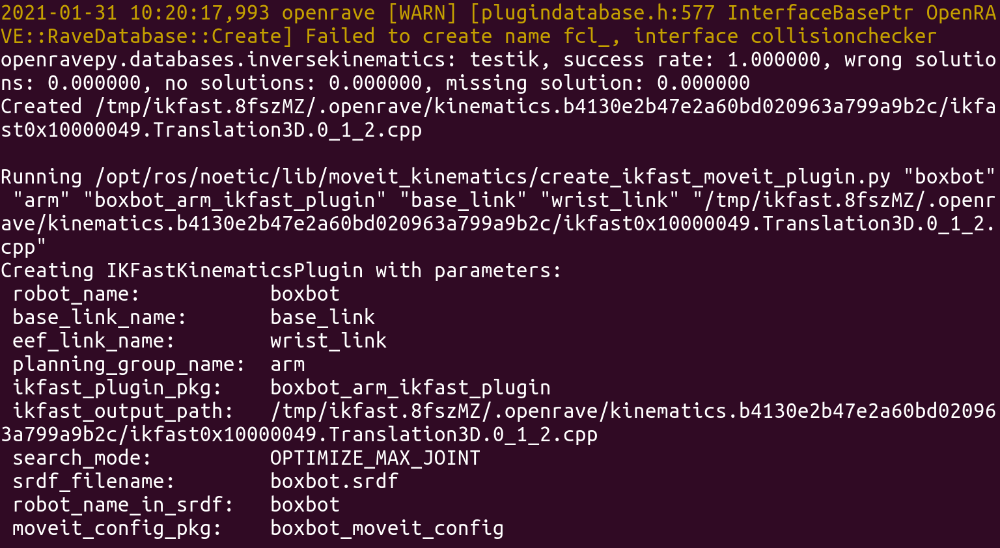

# From Solidworks to Moveit


[TOC]

## Disclaimer

First of all, I want to stress that Moveit is **not** a goto choice for any robot manipulation. It's especially beneficial to use Moveit with a robot that has more than 6 DOFs. And at least has some kind of feedback from sensors(closed loop control) no matter it's IMU or encoder.

If your robot has less than 6 DOFs, then the default IK solver(KDL or Track-it) will not be able to solve the inverse kinematic of your robot. Then you need to either plan in joint space, or generates your own IK solver plugin with Openrave(IKFast). And that may end up with costing more time in the end. So if you're just working with a two-joint robot arm, then better write your own manipulator. 

The second point applies when you are building a large robot which requires precise control like ours. Normally you will use high reduction ratio and micro-steps(assume you are using steppers). Without a proper feedback from encoder(or IMU), floating point error will mess up your precision when you converting m/s(rad/s) to steps/s or vice versa. 

Please do take these  into consideration, otherwise you may find yourself spend dozens of hours in nothing. If you have decided that Moveit is still your best choice, then read along.


## Example repo structure with Moveit

```shell
├── ${your_robot_name}_${plan_group_name}_ikfast_plugin # auto-gen by /opt/ros/noetic/lib/auto_create_ikfast_moveit_plugin.sh
│   ├── ${your_robot_name}_${plan_group_name}_moveit_ikfast_plugin_description.xml
│   ├── CMakeLists.txt
│   ├── include
│   │   └── ikfast.h
│   ├── package.xml
│   ├── src
│   │   ├── ${your_robot_name}_ikfast_moveit_plugin.cpp
│   │   └── ${your_robot_name}_${plan_group_name}_ikfast_solver.cpp
│   └── update_ikfast_plugin.sh
|
├── ${your_robot_name}_description #auto-gen by Solidworks SW2URDF plugin
│   ├── CMakeLists.txt
│   ├── config
│   │   └── joint_names_${your_robot_name}_description_solidworks.yaml
│   ├── launch
│   ├── meshes
│   ├── package.xml
│   ├── urdf
│   │   ├── ${your_robot_name}.csv
│   │   └── ${your_robot_name}.xacro 
│   └── urdf.rviz
|
├── ${your_robot_name}_hardware
│   ├── CMakeLists.txt
│   ├── config
│   │   └── controllers.yaml # ros_control controller manager configuration
│   ├── include
│   │   ├── ${your_robot_name}_control_loop.h
│   │   └── ${your_robot_name}_hw.h
│   ├── launch
│   │   └── hardware_interface.launch
│   ├── package.xml
│   ├── src
│       ├── ${your_robot_name}_control_loop.cpp
│       ├── ${your_robot_name}_hw.cpp
│       └── ${your_robot_name}_hw_main.cpp
|
├── ${your_robot_name}_moveit_config  #auto-gen by Moveit setup assistant
    ├── CMakeLists.txt
    ├── config
    │   ├── ${your_robot_name}.srdf	
    │   ├── chomp_planning.yaml #planner configuration
    │   ├── fake_controllers.yaml 
    │   ├── joint_limits.yaml #joint limits configuration overwrites the limit in URDF
    │   ├── kinematics.yaml #kinematics plugin configuraion
    │   ├── ompl_planning.yaml
    │   ├── ros_controllers.yaml # controllers configuration should match ros_control
    │   └── sensors_3d.yaml
    ├── launch
    │   ├── ${your_robot_name}_moveit.launch
    └── package.xml
```

**Note**

* This is **not** a standard layout, but only a showcase of which components are required to run Moveit on your robot. You're free to have different organization of your packages.
* The SW2URDF plugin will only generates a URDF instead of XACRO you see in above. There's certain benefits of converting the URDF to XACRO, but it's up to you whether or not you want to do it.


## From Solidworks to URDF

For Moveit to plan the motions precisely, the URDF description has to be as close to the real robot as possible when you're working with a customized robot. You can use SW2URDF plugin of Solidworks to achieve this. The Solidworks version I was using is 2020, and the SW2URDF plugin supports it perfectly fine. Not sure about the other versions though.

### Step 1: prepare your Solidworks model
After installing the plugin, the **first key point** is to make sure you have simplified the Solidworks model. By which, I mean each link of your robot should be a sub-assembly by itself instead of composed by loads of parts and assemblies. Checkout this [video](https://www.youtube.com/watch?v=p9c9KoKjEe0&t=363s) to find detailed instructions on how you should make your Solidworks model. 

*A Tip* here is that you can reduce the complexity of your Solidworks model by removing some parts that not affect the dimension of the robot. Since Moveit only cares about the geometry relationship between parts, so it would not affect motion planning. But the behavior in Gazebo might be changed due to the change of physical properties.

If you have followed the video tutorial above, you should have a proper assembly of your robot. Check it by moving the model in Solidworks, and see if it moves as intended and no parts fly around.   

### Step 2: generate the URDF description
With Solidworks 2020, you can find the plugin here in the menu under:

>Tools > Export as URDF

Again, follow [part 2](https://www.youtube.com/watch?v=OSL-zqw4cXs&t=824s) of the video tutorial to configure your robot. *Note here*, in the video it seems that every joint should be configured to have the reference frame(coordinate system that originated at the origin of the joint) with axis in the same directions. That is not necessarily true. The principle here should be: z axis points upwards, x axis points towards the forward direction of your joint. And it's perfectly fine if they don't all aligned across joints.

It's suggested to check all the configurations of the joints and links, since the plugin may not be able to recognize the correct type of the joint and the limits. 

### Step 3: double check the origin and the axis of your model
This is the most important lesson I've learned working with Solidworks and URDF. The plugin will always place the origin of the link(mesh) at the same place as the origin of the reference frame.
And this did cause the **IKFast plugin** behaves abnormally or even could not generate a valid solution. So if you encounter the same issue, you can solve it by:

* adjust the origin of the link(mesh) with Meshlab to the geometry center of the link.

* adjust the generated URDF manually to match the modified meshes.

  


## Moveit configuration
### Step 1: generate the Moveit config package for your robot
It should be straightforward to generate the Moveit config package by following [this tutorial](https://ros-planning.github.io/moveit_tutorials/doc/setup_assistant/setup_assistant_tutorial.html). There are several subtle points need to pay attention to:
* virtual joint is part of the arm group.
* The parent link of the eef should be one of links of arm group **not** eef group.
* The KDL or Track-it IKsolver could only be used with a robot that has more than 6DOF. So if your robot has 5 or less degree of freedom, you can either generate a IKFast IKSolver plugin or write your own IKSolver plugin.

### Step 2(for \< 6DOF): generate the IKFast plugin
It's recommended to follow [this tutorial](https://ros-planning.github.io/moveit_tutorials/doc/ikfast/ikfast_tutorial.html) when generating your own IKFast solver. Several things to mind in this step:
* script will throw some warnings like *can not import scipy* and *warnings about fcl* (like shown in th screen shot below). Normally they won't have any influence on the solver source files generated and can be safely ignored. But any errors(in red font) do matters, so when you see one or some, please check your URDF configuration where normally the fault resides. 
* For the Openrave to find a valid solver, the last three axis of your robot should intersect at a point. In other words, none of them should be parallel to others. 
* You should see success rate 1.0000 with none or very low wrong/no/missing solution rate. Otherwise, the plugin is not correctly generated. 



### Step 3(optional): create the plugin package
If you follow the tutorial above, this step should already be handled for you. But if you are doing it manually as in this [ROS answer](https://answers.ros.org/question/263925/generating-an-ikfast-solution-for-4-dof-arm/#265625), or you stepped into the misery of compiling your own Openrave in a Ubuntu 16.04 VM as I did(This is not recommended). 

Suppose you have already generated the header file ikfast.h and the sovler cpp file with the  long name. Then run the script reate_ikfast_moveit_plugin.py with arguments to generate the plugin.  You can get help with --help option.

```shell
rosrun moveit_kinematics create_ikfast_moveit_plugin.py --help
```
**Note1**: the eef\_link\_name should be the same as the parent link in step 1 i.e. the last link(normally) of your arm group).
**Note2**: the script do use python2 instead of python3. So if your default env is python3, you can change it in the script by doing this: 

```shell
cd /opt/ros/noetic/lib/moveit/_kinematic/
vim create_ikfast_moveit_plugin.py
<Change the "python" in the first line to "python3">
<find all "file.open()" and append "b+" to the end of the modification right qualifier i.e. "r">
```

### Step 4(optional): Config Moveit to use correct kinematics solver plugin
The script should automatically modifies your Moveit configuration. But if it failed, you can do it by modifying the kinematics.yaml file as shown [here](#Example repo structure with Moveit) in the ${your_robot_name}_moveit_config package.

```yaml
${plan_group}:
  kinematics_solver: ${your_robot_name}_${plan_group}/IKFastKinematicsPlugin
  kinematics_solver_search_resolution: 0.005
  kinematics_solver_timeout: 0.05
```

### Step 5: Test your plugin

You can not test plugin with the Rviz visualization tool, since it uses joint\_space planning instead of pose goal. This means your IK solver isn't really working when you use the Rviz. This also applies to moveit commander script command line tool.

You should test it with the setPoseTarget or setPositionTarget function provided by moveit::planning\_interface::MoveGroupInterface if you are using C++. You can consult the [API documentation of Moveit](https://moveit.ros.org/documentation/source-code-api/) for more information.

If your robot can receive goal command and generate a motion with a valid goal, then congras, you are only one step away to have your robot manipulated by Moveit.


## Ros_control setup

For Moveit to manipulate the robot, a FollowJointTrajectory action interface must be provided by your hardware.  [ros_control](http://wiki.ros.org/ros_control) package provides implementation of  joint_trajectory_controller that exposes required interface. Normally, there are three components that you need to config or implement when working with ros_control.

### 1. Controller manager

With controller_manager package, you can spawn, load/unload, stop/start different controllers with ease. All you need to do is to provide a configuration file and a launch file. 

A configuration file could look like this:

```yaml
${your_robot_name}: #namespace
    joint_state_controller:
        type: joint_state_controller/JointStateController
        publish_rate: 50
        
    ${plan_group}_controller:
        type: position_controllers/JointTrajectoryController
        joints:
            - base_tower_joint
            - tower_arm_joint
            - arm_wrist_joint
    boxbot_control_loop:
        loop_hz: 300
        cycle_time_error_threshold: 0.01

    hardware_interface:
        joints:
            - base_tower_joint
            - tower_arm_joint
            - arm_wrist_join
```

Only the joint_state_controller and the ${plan_group}_controller key matters for controller manager. The other two will be read by the hardware_interface which we will talk about later. 

**Note**: the content of the configuration file should match ros_controllers.yaml in the moveit_config package.  Pay special attention if you use namespace like above. Make sure the name in the controller_list key contains the namespace also, like this

```yaml
-controller_list:
  - name: /boxbot/arm_controller #boxbot is the namespace
    action_ns: follow_joint_trajectory
    default: True
    type: FollowJointTrajectory
    joints:
      - base_tower_joint
      - tower_arm_joint
      - arm_wrist_joint
```

Otherwise, you make encounter the error "Action client not connected" since MoveGroup can not find a action client with the same name.

#### Joint state controller

joint_state_controller reads position, velocity and acceleration from the joints(actuators) and publishes it on  topic /joint_states.  The data  will be later consumed by Moveit as well as the the derived robot states in world space instead of joint space from robot_state_publisher. 

The only thing you can change here is the publish rate. 50Hz worked for us, but you can experiment on different values. 

**Note**: if you use namespace when launching the controllers. Then you have to use the same namespace when launching the hardware_interface which will cause the joint state be published on to the topic /${namespace}/joint_states. This will result in the MoveGroup could not read joint states(it will try to read from /joint_states). A workaround would be to employ a joint_state_publisher node in your launch file:

```xml
<node name="joint_state_publisher" pkg="joint_state_publisher" type="joint_state_publisher">
        <rosparam param="source_list">[boxbot/joint_states]</rosparam>
</node>
```

Make sure it has correct source.

#### Trajectory controller

JointTrajectoryController provides a FollowJointTrajectory interface to Moveit.  The term after the '/' indicates what kind of command this controller accepts. Besides trajectory controller, there are also JointPositionController, JointVelocityController, etc. The term before the '/' indicates what kind of command it gives to the hardware_interface. In our case, we used a simple position control paradigm, since we have an open loop control. This will simply forward every command to the hardware interface in position(rad for rotational joint, and meter for linear joint).

If you are using a control model other than position control, you can leverage the build-in PID control loop provided by the controllers. See [here](http://wiki.ros.org/joint_trajectory_controller) for how to cinfig the  gains.

#### Launch the controller manager

To launch the controller manager, add this to your launch file:

```xml
<!--Load the configuation file into ros parameter server-->
<rosparam file="$(find boxbot_hardware)/config/controllers.yaml" command="load"/>

<!--launch the controller manager(spawner)-->
<node name="controller_spawner" pkg="controller_manager" type="spawner" respawn="false"
      output="screen" ns="/boxbot"  args="joint_state_controller arm_controller"/>

<!--launch the robot state publisher required by Moveit-->
<node name="robot_state_publisher" pkg="robot_state_publisher" type="robot_state_publisher"respawn="false" output="screen">
      <remap from="joint_states" to="boxbot/joint_states"/>
</node>
```

**Note**: 

* When launch this alone, ros will complain about "Controller spawner could not find the expected controller_manager ROS interface". This is due not launching the hardware_interface node, so make sure you launch it before the controller_spawner. 

* when launch the controller spawner, we used a namespace. Make sure that this namespace matches the one in the configuration file, in this case, ${your_robot_name}.  

### 2. Hardware_interface

You are required to provide a implementation of the hardware_interface::RobotHW.  A recommended way of doing this is to inherited from the [generic_hw_interface](https://github.com/PickNikRobotics/ros_control_boilerplate/blob/noetic-devel/include/ros_control_boilerplate/generic_hw_interface.h) provided in the [ros_control_bolierplate](https://github.com/PickNikRobotics/ros_control_boilerplate) repository. Then the only thing you need to do is to populate the read() and write() method that actually reads joint states from the robot and writes command to the robot through serial or other protocol. 

You can get some inspiration from [sim_hw_interface.cpp](https://github.com/PickNikRobotics/ros_control_boilerplate/blob/noetic-devel/src/sim_hw_interface.cpp). Of course, you can always implement your own hardware_interface like we did. But after reflection on the project, I do think this is a better way to accomplish it. No need to build the wheels again. 

**Note**:

* There are three attributes for joint states, namely position, velocity and acceleration. You **do not** need to populate them all. Normally, position is required and that's all for the position_controllers. Depending on which kind of controller you're using, you may only need to additionally populate velocity when using  velocity_controllers. 

* Like already mentioned before, do launch this node before the controller spawner. And pay attention to the namespace.

  ```xml
  <node name="boxbot_hardware" pkg="boxbot_hardware" type="node" respawn="false" output="screen" ns="/boxbot"/>
  ```


### 3. Joint limit and Transmission

You should enforce joint limits to prevent the controllers violate it(they know the limits but not necessarily respect it all the time). Follow this [tutorial for setting up the joint limits](https://github.com/ros-controls/ros_control/wiki/joint_limits_interface). You are free to decide which joint limit to enforce or enforce them all.

Transmission can also be handled within hardware_interface. Although if you only has a simple transmission, it's recommended to just implement it yourself. That may save you hours of effort. But if you have a complex transmission like a differential one, follow [this tutorial](https://github.com/ros-controls/ros_control/wiki/transmission_interface) to set up a transmission interface. 


Till now, you should be able to control via Moveit. Have fun. 